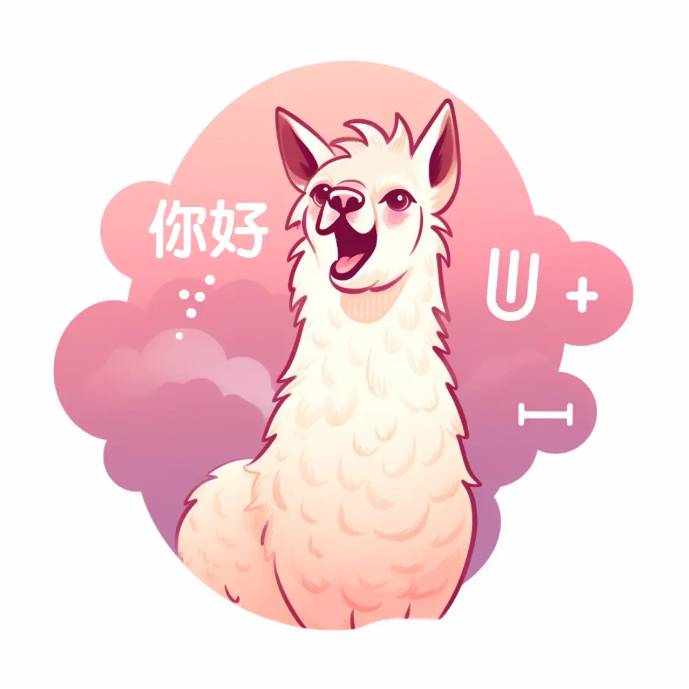

# OpenLLaMA-Chinese

 <div align=center></div>


[OpenLLaMA](https://github.com/openlm-research/open_llama) released a permissively licensed open source reproduction of Meta AI’s LLaMA 7B and 13B trained on the RedPajama dataset and a smaller 3B variant of LLaMA model.
We have conducted fine-tuning on Chinese and English instructions based on it and have publicly released our weights.

Chinese instructions finetuning weights:

- [OpenLLaMA 3B](https://huggingface.co/FittenTech/openllama-chinese-3b)
- [OpenLLaMA 7B](https://huggingface.co/FittenTech/openllama-chinese-7b)
- [OpenLLaMA 13B](coming soon!)

English instructions finetuning weights:
- [OpenLLaMA 3B](coming soon!)
- [OpenLLaMA 7B](coming soon!)
- [OpenLLaMA 13B](coming soon!)

Chinese+English instructions finetuning weights:
- [OpenLLaMA 3B](coming soon!)
- [OpenLLaMA 7B](https://huggingface.co/FittenTech/openllama-chinese-english-7b)
- [OpenLLaMA 13B](coming soon!)

## Data

For Chinese finetuning, we used the [alpaca_data_zh_51k.json](data/alpaca_data_zh_51k.json) from [Chinese-LLaMA-Alpaca](https://github.com/ymcui/Chinese-LLaMA-Alpaca).

For English finetuning, we used the [alpaca_data.json](data/alpaca_data.json) from [StanfordAlpaca](https://github.com/tatsu-lab/stanford_alpaca).

For English+Chinese finetuning, we used both of them.

## Usage
We provide inference code based on [Jittor](https://github.com/Jittor/jittor) and [torch](https://github.com/pytorch/pytorch)

### Jittor Inference
coming soon.

### Torch Inference
We modified the generate code from [LLaMA-X](https://github.com/AetherCortex/Llama-X).

Download the weights and change the `base_model` path in `inference/gen_torch.py`
```shell
python inference/gen_torch.py
```

## Pretraining and Finetuning
FittenTech offers LLMs pretraining and fine-tuning services. Further details can be found [here](https://llm.fittentech.com/).

## Thanks
We would like to express our gratitude to the developers of the following open-source projects, as our project is based on their work.

- [LLaMA](https://github.com/facebookresearch/llama)
- [OpenLLaMA](https://github.com/openlm-research/open_llama)
- [Jittor](https://github.com/Jittor/jittor)
- [JittorLLMs](https://github.com/Jittor/JittorLLMs)
- [LLaMA-X](https://github.com/AetherCortex/Llama-X)
- [Chinese-LLaMA-Alpaca](https://github.com/ymcui/Chinese-LLaMA-Alpaca)
- [StanfordAlpaca](https://github.com/tatsu-lab/stanford_alpaca)
- [transformers](https://github.com/huggingface/transformers)

## License
We adopt the Apache License, following OpenLLaMA's license.
